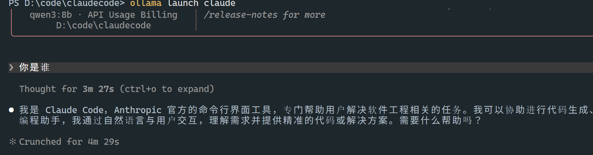

## settings.json 配置

> https://code.claude.com/docs/zh-CN/settings

##　金がないからやはりollamaに使用しよう

```bash
ollama pull qwen3:8b
```

我设置过 models的保存路径 `D:\application\ollama\models`

> https://docs.ollama.ac.cn/integrations/claude-code

## 检查分配的上下文长度和模型卸载情况

为了获得最佳性能，请使用模型的最大上下文长度，并避免将模型卸载到 CPU。使用 ollama ps 检查 PROCESSOR 下的分派情况。
ollama ps



**三种配置方式对比：**

| 配置方式                     | 持久性         | 作用范围       | 推荐场景                    |
| ---------------------------- | -------------- | -------------- | --------------------------- |
| **临时环境变量**             | 关闭终端即失效 | 当前终端窗口   | 快速测试、临时切换          |
| **永久环境变量**             | 永久生效       | 所有终端和项目 | 日常一台电脑固定使用        |
| **配置文件 `settings.json`** | 永久生效       | 全局或特定项目 | 多项目/多模型切换、团队共享 |

配置文件路径说明：

- **全局**：`~/.claude/settings.json`（Windows：`C:\Users\<用户名>\.claude\settings.json`）
- **项目级（团队共享）**：`项目根目录/.claude/settings.json`（可提交 Git）
- **项目级（个人私有）**：`项目根目录/.claude/settings.local.json`（加入 .gitignore）

## 启动方式

> https://docs.ollama.ac.cn/integrations/claude-code

比如进入你的 Java 项目： `cd D:\project\my-springboot`
`ollama launch claude --model qwen3:8b`
它会直接进入 Claude Code 界面。
ollama launch claude

或者

````bash
export ANTHROPIC_AUTH_TOKEN=ollama
export ANTHROPIC_API_KEY=""
export ANTHROPIC_BASE_URL=http://localhost:11434

# windows
$env:ANTHROPIC_AUTH_TOKEN="ollama"
$env:ANTHROPIC_API_KEY=""
$env:ANTHROPIC_BASE_URL="http://localhost:11434"


claude --model qwen3:8b


qwen3:8b 500a1f067a9f 11 GB 65%/35% CPU/GPU 40960 4 minutes from now

跑不动 换模型
```Bash
ollama pull qwen3:4b
ollama launch claude --model qwen3:4b
````
